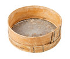

.. ciur documentation master file, created by
   sphinx-quickstart on Sun Jul  9 11:59:38 2017.
   You can adapt this file completely to your liking, but it should at least
   contain the root `toctree` directive.

Welcome to Python-Ciur
======================

..

    *Ciur is a scrapper layer in development*

    *Ciur is a lib because it has less black magic than a framework*

It exports all scrapper related code into separate layer.

If you are annoyed by
`Spaghetti code <https://en.wikipedia.org/wiki/Spaghetti_code>`_,
**SQL** inside **PHP** or inline **CSS** inside **HTML**
THEN you also are annoyed by XPATH/CSS selectors code inside crawler.

**Ciur** gives the taste of `Lasagna code <http://c2.com/cgi/wiki?LasagnaCode>`_
generally by enforcing encapsulation for scrapping layer.

It tries to not repeat the `bad code <./bad_code/>`_.

What does CIUR mean?
====================

Ciur is Romanian for `Sieve <https://en.wikipedia.org/wiki/Sieve>`_.

It fulfils the same purpose in the sense of being a
``device for separating wanted elements from unwanted material``.

Python ciur API
---------------

.. code-block:: python

    >>> import ciur
    >>> from ciur.shortcuts import pretty_parse_from_resources
    >>> with ciur.open_file("example.org.ciur", __file__) as f:
    ...    print pretty_parse_from_resources(
    ...            f,
    ...            "http://example.org"
    ...    )
    {
         "root": {
             "name": "Example Domain",
             "paragraph": "This domain is established to be used for illustrative examples in documents. You may use this\n    domain in examples without prior coordination or asking for permission."
         }
     }

Samples of usage:

* Say `Hello World <./hello_world.rst>`_ in ciur language with `<http://www.example.org>`_
* Container `Docker + lambda amazon + Ciur combination <docker/README.rst>`_ for cuir
* `Exchange money rates world wide parsers <https://bitbucket.org/ada/ciur.example.exchange>`_ based on Ciur
  --> parsing world wide (40 sources, 4 country) currency exchange rates.
* https://bitbucket.org/ada/ciur.example.social --> parsing networking sites (such as Facebook, Linkedin, Xing ...) (not yet ready for open realease)

For Developers:
===============

* Local `Python Virtual environment <docs/source/python_virtual_environment.rst>`_ for cuir

.. Features
   ========

   The ``ciur`` can do a lot.

   Please see `list of all features <./features.rst>`_.

TODO:
=====

 * TODO: http://lybniz2.sourceforge.net/safeeval.html
 * demo on cloud9
 * build documentation on readthedocs
 * http://lxml.de/lxmlhtml.html#parsing-html

   .cssselect(expr):

   .base_url:

.. ====== Last Mile
   https://youtu.be/FVEEndIwOSA?t=2243

.. include:: contents.rst

If you can't find the information you're looking for, have a look at the
index or try to find it using the search function:

* :ref:`genindex`
* :ref:`search`
